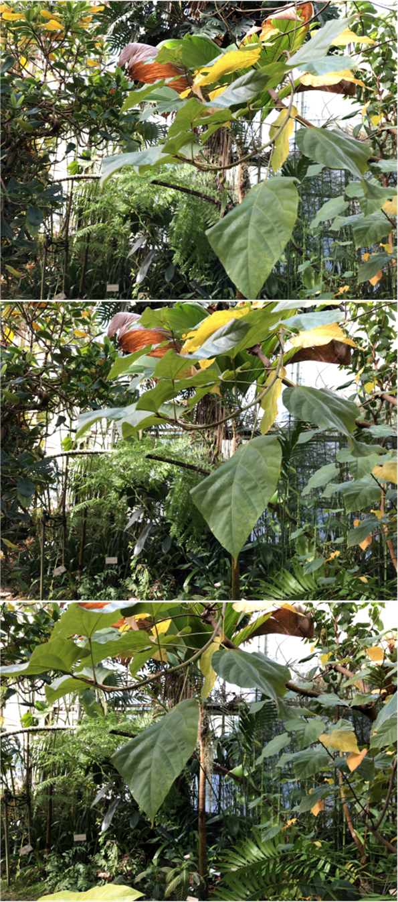
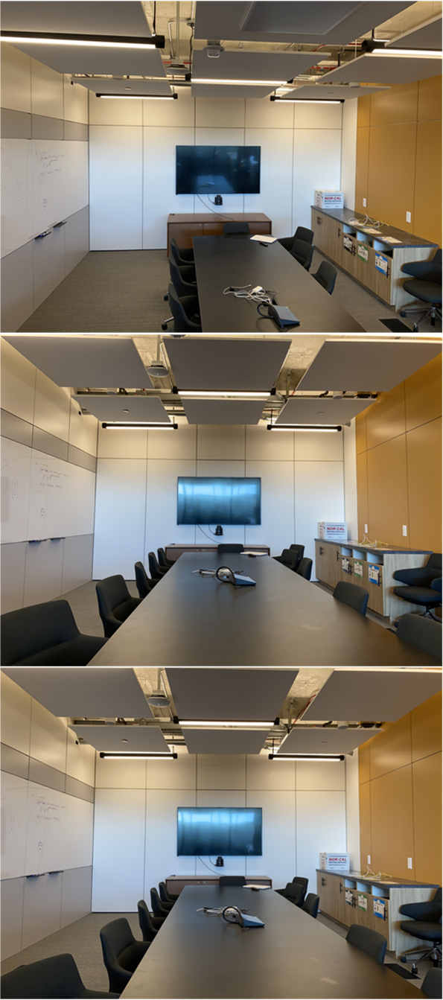

<div align="center">
<h1>F<sup>2</sup>Plenoxels: Fast Voxel Radiance Fields without Neural Networks for Few-Shot View Synthesis</h1>

<div>
    Jun Peng&emsp;
    Chunyi Chen&emsp;
    Yunbiao Liu
</div>

</div>

---------------------------------------------------
<!--
<p align="center" >
  <a href="">
    
  </a>
</p>
-->

<center>
   
   
</center>


<!--
<center>
   
   
</center>
-->

## Environmental Setups
Tested on Windows 10, CUDA 11.8, Python 3.18, PyTorch 1.11.0

```cmd
conda create -n f2plenoxels python=3.8
conda activate f2plenoxels
pip install torch==1.11.0+cu113 torchvision==0.12.0+cu113 --extra-index-url https://download.pytorch.org/whl/cu113
pip install -r requirements.txt
```
Install CUDA extensions

```cmd
pip install -e . --verbose
```

**If and only if** your CUDA toolkit is older than 11, you will need to install CUB as follows:
`conda install -c bottler nvidiacub`.
Since CUDA 11, CUB is shipped with the toolkit and installing this may lead to build errors.

## Data Preparation

- Download Blender and LLFF datasets from [link](https://drive.google.com/drive/folders/1cK3UDIJqKAAm7zyrxRYVFJ0BRMgrwhh4).

- Download the preprocessed depths predicted by [VGGT](https://github.com/facebookresearch/vggt) from [link](https://drive.google.com/file/d/1ghOT883-h3wqbdCQBsT9n21hPYURyaWa/view?usp=drive_link).

After unzipped, these files should be rearranged as follows:

```
data
|-- nerf_llff_data
|   |-- fern
        |-- depths_4_VGGT
            |-- depth_001.exr
            |-- depth_010.exr
            |-- depth_019.exr
        |-- images
        # ... more files
        |-- trimesh.png
|   |-- flower
|   # ... more scenes
|   |-- room
|   `-- trex
`-- nerf_synthetic
    |-- chair
        |-- depth_VGGT
            |-- depth_002.exr
            |-- depth_026.exr
            |-- depth_055.exr
            |-- depth_086.exr
        |-- test
        # ... more files
        |-- transforms_val.json
    |-- drums
    # ... more scenes
    |-- mic
    `-- ship
```

## Running

We conduct our experiments on a single NVIDIA Quodra P5000 GPU (16 GB).

### Blender dataset

Take `hotdog` scene as an example:

```python
## Optimization
python ./opt/opt_fewshot.py ./data/nerf_synthetic/hotdog --gpu_id 0 --train_dir ./logs/blender_4v/hotdog --config ./opt/configs/syn_4v.json --hardcode_train_views 2 26 55 86

## Evaluation
python ./opt/render_imgs.py ./logs/blender_4v/hotdog/ckpt.npz ./data/nerf_synthetic/hotdog --gpu_id 0 --white_bkgd 1 --background_brightness 1.0
```
For running on the whole dataset, please run `./scripts/blender_4v.bat`

### LLFF dataset

Take `room` scene as an example:

```python
## Optimization
python ./opt/opt_fewshot.py ./data/nerf_llff_data/room --gpu_id 0 --train_dir ./logs/llff_3v/room --config ./opt/configs/llff_3v.json --hardcode_train_views 1 20 39

## Evaluation
python ./opt/render_imgs.py ./logs/llff_3v/room/ckpt.npz ./data/nerf_llff_data/room --gpu_id 0 --background_brightness 0.5
```
For running on the whole dataset, please run `./scripts/llff_3v.bat`


## Results

Comparison on `Hotdog` scene ([SynergyNeRF](https://github.com/MingyuKim87/SynergyNeRF), [DNGaussian](https://github.com/Fictionarry/DNGaussian), [ReVoRF](https://github.com/HKCLynn/ReVoRF) and Ours from left to right).
<div style="display: flex; justify-content: space-between;">
   
   
   
   
</div>

---------------------------------------------------

Comparison on `Fern` scene ([VGOS](https://github.com/SJoJoK/VGOS), [FSGS](https://github.com/VITA-Group/FSGS), [FrugalNerf](https://github.com/linjohnss/FrugalNeRF) and Ours from left to right).
<div style="display: flex; justify-content: space-between;">
   
   
   
   
</div>


## Checklist

- [ ] Release the script for depth acquisition
- [ ] Release pretrained checkpoints


## Acknowledgment


The code is built upon [Plenoxels](https://github.com/sxyu/svox2) implementation. Thanks for sharing!


